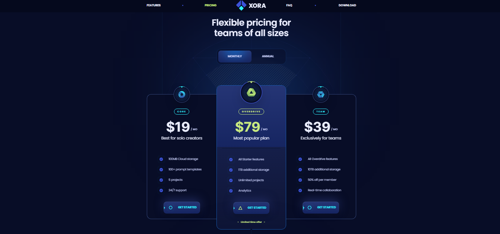

<div id="top"></div>

[](https://react.dev/)


[](https://inorganik.github.io/countUp.js/)
[](https://motion.dev/)


<!-- PROJECT LOGO -->
<br />
<div align="center">
  <a href="https://xora-omega-nine.vercel.app/">
    
  </a>
  <h1 align="center">Xora</h1>

  <p align="center">
    <a href="https://xora-omega-nine.vercel.app/">View Demo</a>
    ·
    <a href="https://github.com/SalahShallapy/Xora/issues">Report Bug</a>
  </p>
</div>

Xora is a cutting-edge web application designed with a sleek, responsive UI built using React and Tailwind CSS. It offers a futuristic and engaging user experience with dynamic features, smooth navigation, and optimized performance.

## Project overview

### Home page overview


### Features section overview


### FAQ section overview


### pricing section overview



## Features

- **Reusable Components**: Modular design with reusable components Styled using Tailwind CSS and clsx for dynamic class names.

- **Dynamic Navigation**: Smooth scrolling between sections using `react-scroll`.

- **Interactive FAQ Section**: Dropdown animations with `Framer Motion`, only one FAQ item can be expanded at a time for a clean user experience.

- **Animations and Effects**: Hover effects, transitions, and shadows using Tailwind CSS.

- **Modern UI/UX**: A clean and professional design for an enhanced user experience.

- **Responsive**; Ensures seamless functionality and aesthetics across all devices.

## Project Structure

```
Xora
│      .gitignore
│      eslint.config
│      index.html
│      package-lock.json
│      package.json
│      postcss.config.js
│      README.md
│      tailwind.config.js
│      vite.config.js
│
├───public -----> All images sources
│
├───src
│    │  App.css
│    │  App.jsx
│    │  index.css
│    │  main.jsx
│    │
│    └───components
│    │      Button.jsx
│    │      FaqItem.jsx
│    │      Marker.jsx
│    │      TestimonialItem.jsx
│    │
│    └───sections
│    │      Download.jsx
│    │      Faq.jsx
│    │      Features.jsx
│    │      Footer.jsx
│    │      Header.jsx
│    │      Hero.jsx
│    │      Pricing.jsx
│    │      Testimonials.jsx
│    │
│    └───constants
│    │      index.jsx
│    │
│    └───assets
│           react.svg
│
```

## Installation

To get started with the project locally:

1. Clone the repository:
   ```bash
   git clone https://github.com/SalahShallapy/Xora.git
   ```
2. Navigate to the project directory:
   ```bash
   cd Xora
   ```
3. Install dependencies:
   ```bash
   npm install
   ```
4. Run the project:
   ```bash
   npm run dev
   ```

## Contributing

Contributions are what make the open source community such an amazing place to learn, inspire, and create. Any contributions you make are **greatly appreciated**.

If you have a suggestion that would make this better, please fork the repo and create a pull request. You can also simply open an issue with the tag "enhancement".
Don't forget to give the project a star! Thanks!

1. Fork the Project
2. Create your Feature Branch (`git checkout -b feature/AmazingFeature`)
3. Commit your Changes (`git commit -m 'Add some AmazingFeature'`)
4. Push to the Branch (`git push origin feature/AmazingFeature`)
5. Open a Pull Request
   ?
